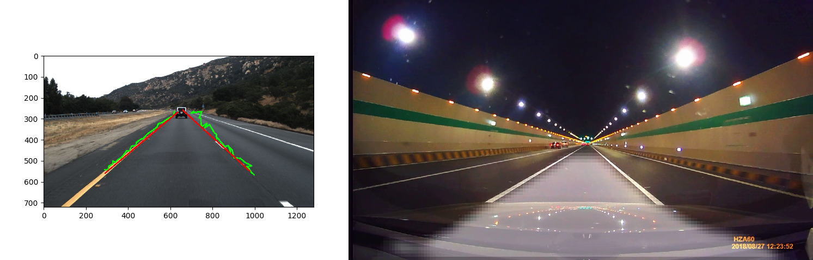

<h2>Lane-Detection</h2>

A lane is part of a roadway (carriageway) that is designated to be used by a single line of vehicles, to control and guide drivers and reduce traffic conflicts.
The task that we wish to perform is that of real-time lane detection in a video. There are multiple ways we can perform lane detection. We can use the learning-based approaches, such as training a deep learning model on an annotated video dataset, or use a pre-trained model. In this project I used the deep learning approach. 

<ol>
  <li> Try to solve lane detection as Regression problem.</li>
  <li> Solve lane detection as Semantic Segmentation problem. </li>
</ol>

<h2> Dataset. </h2>
  
 For regression I used dataset from TuSimple available https://github.com/TuSimple/tusimple-benchmark/blob/master/doc/lane_detection/guideline.md 
  where as for semantic segmentation thanks to Michal Virgo https://github.com/mvirgo/MLND-Capstone 

<h2> File structure </h2>
  
I try to keep the code seprate for lane detection using semantic segmentation vs lane detection using Regression.
  all the files related to semantic segmentation is inside the folder name lane_detection_semantic_segmentation. 
  Code inside the file does exactly same as the name of the file suggested for example train.py is used for training the network so all the train loop logic is inside that file. Feel free to explore
  

  
<h2> Installation </h2>
    <ul>
        <li>Python==3.6.6</li>
        <li>Pytorch==1.6.0</li>
    </ul>

<h2> Architecture Information for Regression & Semantic Segmentation </h2>
 
 Regression Architecture
  <ul>
    <li>I use Alexnet for backbone followed by two different dense layer which output left lane and right lane.</li>
  </ul>
 

 
 
 Semantic Segmentation 
 <ul>
  <li> I use architecture of Michal Virgo which is encoder and decoder architecture. Some one can try using different architecture like segnet, Unet etc.</li> 
 </ul>
 

  
  <h2>Results</h2>
  <figure>
    
  </figure>
